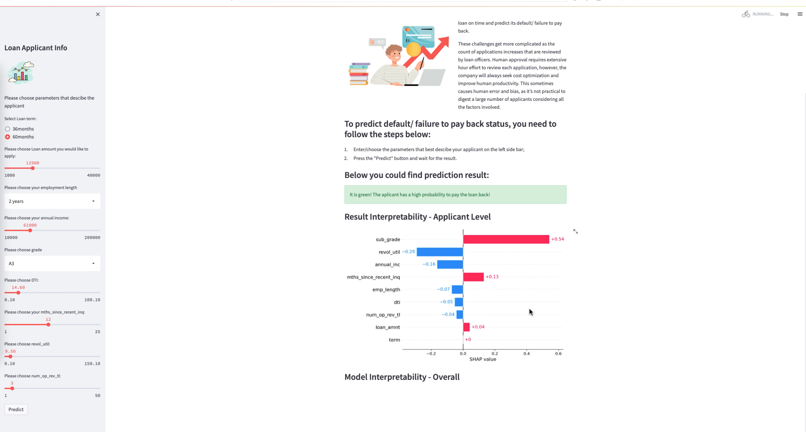
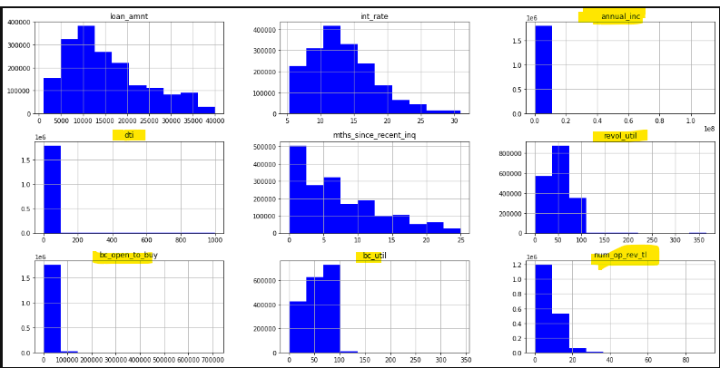
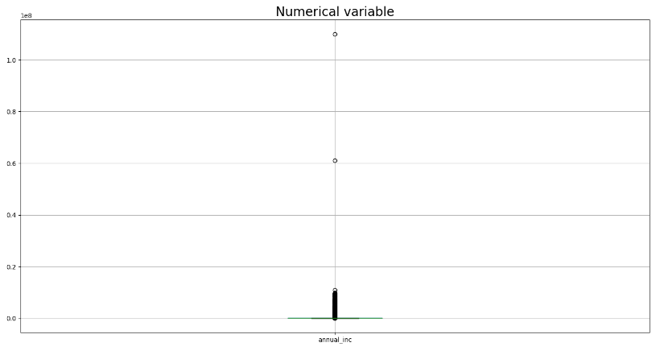
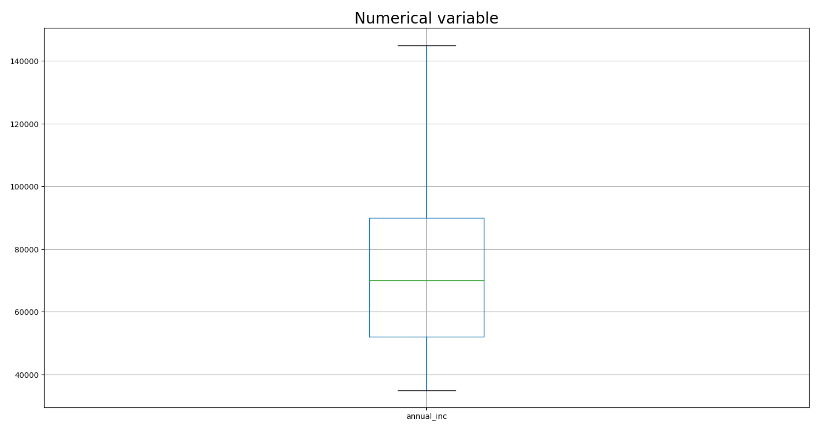
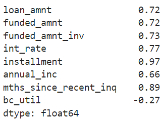
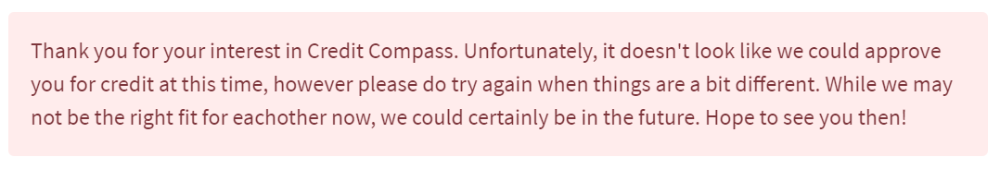

# Credit Compass - Loan Prediction using Machine Learning and the Streamlit Web Application

*By Emma, Lucas and Nav*


## Background

Machine learning can often seem technically daunting and over complicated, and it can become difficult to decipher the insights that the technology provides. It can also be a convoluted process when assigning the initial conditions that a machine learning algorithm will use to predict the outcomes that are sought after.


Designing a front-end application that is sufficiently intelligent to interact with a machine learning algorithm in a concise and digestible way can be a saving grace for financial professionals to save them valuable time in generating instant predictions regarding an individual's suitability to receive credit, and remove much of the headache that can otherwise be involved in hard-coding the desired metrics and lending criteria into an algorithm.


Streamlit is a brilliant example of a front-end application which offers compatibility with Python, setting the stage for where much of our back-end, machine-learning algorithmic grunt-work may be computed and ultimately interface with our front-end to deliver a polished experience. It is attractive, clean, easy to use, highly interactive, and offers fast itterations, testing and deployment of Python-based prototype applications.

## Our Project


Perhaps the most crucial decision that a lender must make is to decide which potential clients harbour the least risk of defaulting on any credit that the lender may chose to lend to them. Clasically lenders have, mostly unknowingly, made such decisions through the lense of various biases and prejudice, however including this obvious shortcoming, as well as the increasing bulk of credit applications over time, a fast, cost effective and reliable method of taking the guess-work out of selecting profitable clients has become increasingly valuable and necessary.

Clients also often feel left in the dark when interacting with lenders, and are often ignorant to the credit aquisition process that takes place behind closed doors. There is good reason to suggest that greater client inclusion in the credit attainment process would pay dividends in increasing customer satisfaction and retention.

Our project aims to solve the problem of rapidly calculating lending risk by leveraging data science and Machine Learning, all the while closely involving clients in the process. First, we use an open-source data set from Kaggle which contains loan data on Lending Club clients from 2007 through to 2018 as it offers a wealth of information that assists us in establishing a robust machine learning algorithm. Our machine learning model is designed to semi-automate the approval process, optimising the trade-off between revenue that the creditor may generate and losses incured due to borrower default, ultimately minimising much of the risk associated with lending.

We use scikit-learn machine learning packages to generate the predictive algorithm, and couple this back-end with our streamlit front-end for the presentation and demonstration of our product. The lender may then offer this web-based application to their customers so that they may query their own loan suitability, greatly increasing their sense of inclusion in the process. Our goal is to produce a reliable and efficient solution to improve the overall lending process and streamline employee-machine-client interactions to provide transparent insights regarding any one individual's creditworthiness.

#### Mission: Helping customers to learn from their data

***The User Interface of the completed web-based application appears as follows:***



## Usage and Installation

With Credit Compass, it's never been easier to figure out anyone's suitability to receive a loan. Simply enter in the user's details, press **```GO!```** and *hey presto*, our application intelligently compares the client's unique situation against millions of other users using advanced machine learning techniques to deliver a professional recommendation of the credit, and whether or not they're likely to be approved by a lender.

The application is completely web-based with no download or installation required. Simply enter the key details and in a few minutes receive an accurate response with no strings attached. The online application only requires the following client inputs:

- ```Loan Term``` 36 or 60 months
- ```Loan Amount``` $1,000 - $40,000
- ```Employment Length``` >1 year - 10+ years
- ```Annual Income``` $10,000 - $200,000
- ```Grade``` Score based on borrower's credit history from A1 (favourable) to G5 (unfavourable)
- ```DTI or Loan Score based on Previous Credit``` Score between 0.10 - 100.10
- ```Months Since Recent Inquiry``` 1 month - 25 months
- ```Revolving Line Utilisation Rate``` Score between 0.10 - 150.10
- ```Number of Open Revolving Accounts``` Between 1 - 50

### SHAP Value

> SHapley Additive exPlanations

Below the prediction of the client's creditworthiness is displayed a SHAP value which is a calculation that represents the relative influence that each of the model's constituant features have had on the final prediction. It can be thought of as the 'weighting' that each feature had upon the final result of creditworthiness that the model predicted, and assists in lifting the veil with regards to identifying which aspects of a client's financial profile effect their risk determination, thus providing the consumer with a greater sense of transparency and insider knowledge.

## How we Got Here

*The Journey So Far*

##### Finding the Data Set
We bagan our journey by sourcing the most relevant data set that would provide us with a sufficient amount of usable information. This was for the purpose of developing a suitable machine learning model that may accurately predict a borrower's liklihood of being granted a loan. As we were using a similar project to this for inspiration (declared below in our attribution statement), we decided to proceed with the data set that the aforementioned project had used, and apply our own unique data cleaning and processing in order to develop a novel model.

Namely, the data set used was a collation of information gathered by a credit institution known as 'Lending Club' of their customers between the years 2007 - 2018, which was sourced from Kaggle.

##### Pre-processing the Data
Initially, a seemingly straighforward issue that we encountered was simply the file size of the data set and the fact that it was available as a ```.gz``` file  (gzip), and was therefore compressed. There was some initial difficulty involved in getting the file to read into our jupiter-lab notebook correctly, and after a series of troubleshooting steps over multiple occasions, we were eventually able to render the file readable and begin our data analysis.

*Univariate Data Analysis*
Next, we had to contend with the fact that the data was incomplete with several null values, as well as the data being skewed. Our first step in resolving this was identifying the quantity of null values before removing them from our data. Then, we dealt with the **outliers** in our data set which can significantly distort the feature distribution within our machine learning algorithms (potential candidates at this stage for ML models being Linear Regression, Logistic Regression, a Support Vector Machine, or a Random Forest Machine). We then proceeded to account for these outliers by removing them.

Identifying the Degree to which the data was skewed:


Identifying the outliers in the data using box and whisker plots:
 

Following this, we ran a report to test for the *skewness* of the data that we had left to work with and found that the remaining features were only moderately skewed. Considering this, we were happy with the data's balance and proceeded making the data readable for a machine learning algorithm.



*Turning Categorical Features into Numerical Values*
At this point there were several features that would be unreadable by any of the machine learning algorithms we had in mind to eventually build our model. We identified that we had both ordinal and non-ordinal categorical features and used ordinal encoding and one-hot-encoder, respectively, to transform these variables into usable numerical values. At this point, pre-processing the data was complete.

##### Building and Training the Machine Learning Models
In order to explore alternative pathways on reaching our destination, we decided on implementing two avenues of machine learning in our research stage prior to proceeding to the development of a streamlit application so that we may evaluate which we would prefer by assessing their accuracy. We eventually landed on assigning a Logistic Regression model as our baseline and comparing it against a Random Forest Machine model.

The final accuracy score that we were able to achieve for either of these options turned out to be almost identical; the Logistic Regression model's best and final score was a significantly impressive 0.8, while the Random Forest Machine model produced an equally as impressive 0.79. Now that the data had been processed, fed into a machine learning model and tested, we were ready to proceed to building the streamlit application such that a user may interactively leverage the models predictions in accordance to the information they input into the application.

##### Building the Streamlit Application
**Gather Input**
*Main Page*
Firstly, we set up the main page layout by placing ourselves in the shoes of our potential users and laid out clear instructions on how to use the application, along with an explanation on how the application is able to predict the loan viability of the user. As we are looking to reassure consumers who may otherwise find it frustrating and difficult to deal with the rejection and/or hassle of assessing their own risk profile, or the risk profile a lender may implement to judge whether they are worthy of receiving credit, we sought to reassure users that their credit rating would remain undisturbed, and futhermore, that the process is easy and straightforward.

We then explain the SHAP value and inform them that it greatly increases transparency between the lender and the user by revealing precisely which of the features used in the machine learning algorithm were most influencial (carried the most weight) in determining their credit suitability.

*Sidebar*
The sidebar was then constructed so that the user may have the functionality to input their data into the application to receive their personalised prediction of creditworthiness. The metrics that the user is able to manipulate have been listed above under 'usage and installation', following which the user is able to simply click 'GO!' to receive their prediction. For input metrics that may carry a degree of ambiguity for the user, such as loan scores based on their previous credit obligations (DTI; a type of credit score), a breif explanation is provided to illuminate the user on the meaning of the specific metric, as well as guidance on what to do if they are still unsure.

**Transform Input**
We then implemented a cleaner function responsible for transforming the inputs the user selects into values that may be 'fit' into the pre-trained machine learning model (in this case, our logistic regression model).

**Run Prediction!**
By selecting 'GO!', the user is then able to run the prediction algorithm to generate a result. We used the ```predict_proba``` method based on the user's input and declared a lower borderline of 0.78. Ergo, any predictions generated below the 0.78 threshold would lead to an ```st.error``` outcome, with those above the threshold instead leading to the ```st.success``` logic pathway. In either case, a message would be presented to explain the prediction and what it means for the consumer as shown below.

Likely to be approved for credit:


Unlikely to be approved for credit:


**Interpreting the Machine Learning Function to Produce a Visualised SHAP Value**
In order to produce a SHAP value, the initial data set used to build the machine learning algorithm is cached, with ```train_test_split``` applied to it. We then initialised a JS (javascript) visualisation code and created an explainer object for both the model used and ```X_train```. Finally, SHAP values were then calculated with an interpretation presented below the visualisation.


## Attribution Statement

The information in this project was gathered from various sources, including online articles, research papers, and publicly available datasets. The following sources were used in this project:

- The Medium article ["Create Web Apps for Your ML Model using Python and Streamlit"](https://medium.com/@data.science.enthusiast/create-web-apps-for-your-ml-model-using-python-and-streamlit-cc966142633d) by Data Science Enthusiast provided the code and tutorial for building a web app using Python and Streamlit.

- The research paper ["A Comparative Study of Machine Learning Algorithms for Credit Risk Analysis"](https://www.researchgate.net/publication/342415255_A_Comparative_Study_of_Machine_Learning_Algorithms_for_Credit_Risk_Analysis) by Ahmedullah Aziz and Ahmed Fawad, which compared the performance of various machine learning algorithms for credit risk analysis.

- The publicly available [LendingClub dataset](https://www.kaggle.com/wendykan/lending-club-loan-data) on Kaggle, which provided a large sample of loan data for analysis.

We would like to thank the authors of these sources for their valuable contributions to this project.