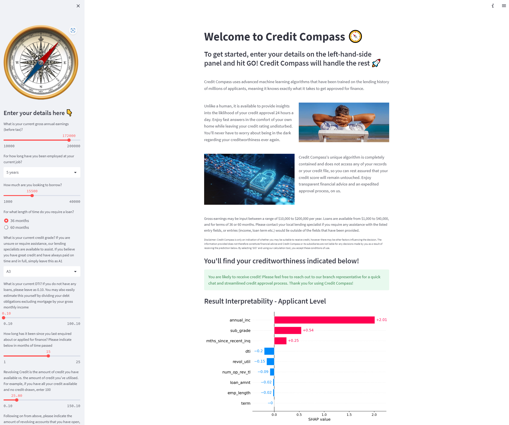

# Loan Prediction using Machine Learning and the Streamlit Web Application


## Background

Machine learning can often seem technically daunting and over complicated, and it can become difficult to decipher the insights that the technology provides. It can also be a convoluted process when assigning the initial conditions that a machine learning algorithm will use to predict the outcomes that are sought after.


Designing a front-end application that is sufficiently intelligent to interact with a machine learning algorithm in a concise and digestible way can be a saving grace for financial professionals to save them valuable time in generating instant predictions regarding an individual's suitability to receive credit, and remove much of the headache that can otherwise be involved in hard-coding the desired metrics and lending criteria into an algorithm.


Streamlit is a brilliant example of a front-end application which offers compatibility with Python, setting the stage for where much of our back-end, machine-learning algorithmic grunt-work may be computed and ultimately interface with our front-end to deliver a polished experience. It is attractive, clean, easy to use, highly interactive, and offers fast itterations, testing and deployment of Python-based prototype applications.

## Our Project

Perhaps the most crucial decision that a lender must make is to decide which potential clients harbour the least risk of defaulting on any credit that the lender may chose to lend to them. Clasically lenders have, mostly unknowingly, made such decisions through the lense of various biases and prejudice, however including this obvious shortcoming, as well as the increasing bulk of credit applications over time, a fast, cost effective and reliable method of taking the guess-work out of selecting profitable clients has become increasingly valuable and necessary.

Clients also often feel left in the dark when interacting with lenders, and are often ignorant to the credit aquisition process that takes place behind closed doors. There is good reason to suggest that greater client inclusion in the credit attainment process would pay dividends in increasing customer satisfaction and retention.

Our project aims to solve the problem of rapidly calculating lending risk by leveraging data science and AI, all the while closely including clients in the process. First, we use an open-source dataset from Kaggle which contains loan data on Lending Club clients from 2007 through to 2018 as it offers a wealth of information that assists us in establishing a robust machine learning algorithm. Our machine learning model is designed to semi-automate the approval process, optimising the trade-off between revenue that the creditor may generate and losses incured due to borrower default, ultimately minimising much of the risk associated with lending.

We use scikit-learn machine learning packages to generate the predictive algorithm, and couple this back-end with our streamlit front-end for the presentation and demonstration of our product. The lender may then offer this web-based application to their customer's so that they may query their own loan suitability, greatly increasing their sense of inclusion in the process. Our goal is to produce a reliable and efficient solution to improve the overall lending process and streamline employee-machine-client interactions to provide transparent insights regarding any one individual's creditworthiness.

***The User Interface of the completed web-based application appears as follows:***



## Usage and Installation

With our *-insert application name-* app, it's never been easier to figure out anyone's suitability to receive a loan. Simply enter in the details of the person who's looking to aquire a line of credit, press **```GO!```** and *hey presto*, our application intelligently compares your client's unique situation against millions of other users using advanced machine learning techniques to deliver a professional recommendation of the credit, and whether not not it's likely to be approved by a lender.

The application is completely web based with no download or installation required. Simply enter the key details and in a few minutes receive an accurate response with no strings attached. The online application only requires the following client inputs:

- ```Loan Term``` 36 or 60 months
- ```Loan Amount``` $1,000 - $40,000
- ```Employment Length``` >1 year - 10+ years
- ```Annual Income``` $10,000 - $200,000
- ```Grade``` Score based on borrower's credit history from A1 (favourable) to G5 (unfavourable)
- ```DTI or Loan Score based on Previous Credit``` Score between 0.10 - 100.10
- ```Months Since Recent Inquiry``` 1 month - 25 months
- ```Revolving Line Utilisation Rate``` Score between 0.10 - 150.10
- ```Number of Open Revolving Accounts``` Between 1 - 50

### SHAP Value

> SHapley Additive exPlanations

Below the prediction of the client's creditworthiness is displayed a SHAP value which is a calculation within machine learning which represents the relative influence that each of the individual constituant features within the algorithm had on the final prediction. It can be thought of as the 'weighting' that each feature had upon the final result of creditworthiness that the model predicted, and assists in lifting the veil with regards to which aspects of a client's financial profile effect their risk determination, thus providing the consumer with a greater sense of transparency and insider knowledge.

---

## Sample Case Study

*example of the application in action; what results are produced with differing inputs of initial variables, etc..*

---

## How we Got Here

*The Journey So Far*

### Exploratory Data Analysis

**Univariate Analysis**<br/>

We utilised univariate data analysis to individually assess each of the variables involved in the machine learning model to better understand their impact and relation to the data as a whole. This assisted us in highlighting the characteristic influences that each of the seperate features have on our data set to improve our understanding of the machine learning model.

**Identifying Outliers in the Data**<br/>

Highlighted below are features within the dataset which were identified as outliers:


## Internal notes - streamlit writeup, non-code

Code to be input into write-up of the streamlit app, potentially, following team input:

-- | -- | -- | -- | -- | -- | -- | -- | -- | -- | -- | -- | -- | -- | -- | -- | -- | -- | -- | -- | -- | -- | -- | -- | 

st.title("Welcome to -application_name-")

st.subheader("To get started, enter your details on the left-hand-side panel and hit GO! -application_name- will handle the rest :rocket:")

st.write("""-application_name- uses advanced machine learning algorithms that have been trained on the lending history of millions of applicants, meaning it knows exactly what it takes to get approved for finance. Unlike a human, it is available to provide insights into the liklihood of your credit approval 24 hours a day. Enjoy fast answers in the comfort of your own home while leaving your credit rating undisturbed. -application_name-'s unique algorithm is 100% self contained and does not access any of your records or your credit file, so you can rest assured that your credit score will remain untouched. Enjoy transparent financial advice and an expedited approval process, on us.""")

st.subheader("Below you could find prediction result: ")

-- | -- | -- | -- | -- | -- | -- | -- | -- | -- | -- | -- | -- | -- | -- | -- | -- | -- | -- | -- | -- | -- | -- | -- | 

---

##Progress

##Day 1
• 1 : We deep dive into the business problem, and spend our best effort to analyze and prepare the dataset;
• 2:  We build our first ML model, evaluate the quality of it and understand model decisions with interpretability;

## Day 2
• 3: We build and optimize different types of models to find the best one;
• 4: We build and evaluate Neural Network model and compare result with previous models;

## Day 3
• 5: Last, we get practical by deploying and making our best model available publicly

## Day 4
• 6: Front end deployment use Streamlit

## Day 5
• 7: Presentation


## Attribution Statement

The information in this project was gathered from various sources, including online articles, research papers, and publicly available datasets. The following sources were used in this project:

- The Medium article ["Create Web Apps for Your ML Model using Python and Streamlit"](https://medium.com/@data.science.enthusiast/create-web-apps-for-your-ml-model-using-python-and-streamlit-cc966142633d) by Data Science Enthusiast provided the code and tutorial for building a web app using Python and Streamlit.

- The research paper ["A Comparative Study of Machine Learning Algorithms for Credit Risk Analysis"](https://www.researchgate.net/publication/342415255_A_Comparative_Study_of_Machine_Learning_Algorithms_for_Credit_Risk_Analysis) by Ahmedullah Aziz and Ahmed Fawad, which compared the performance of various machine learning algorithms for credit risk analysis.

- The publicly available [LendingClub dataset](https://www.kaggle.com/wendykan/lending-club-loan-data) on Kaggle, which provided a large sample of loan data for analysis.

We would like to thank the authors of these sources for their valuable contributions to this project.

